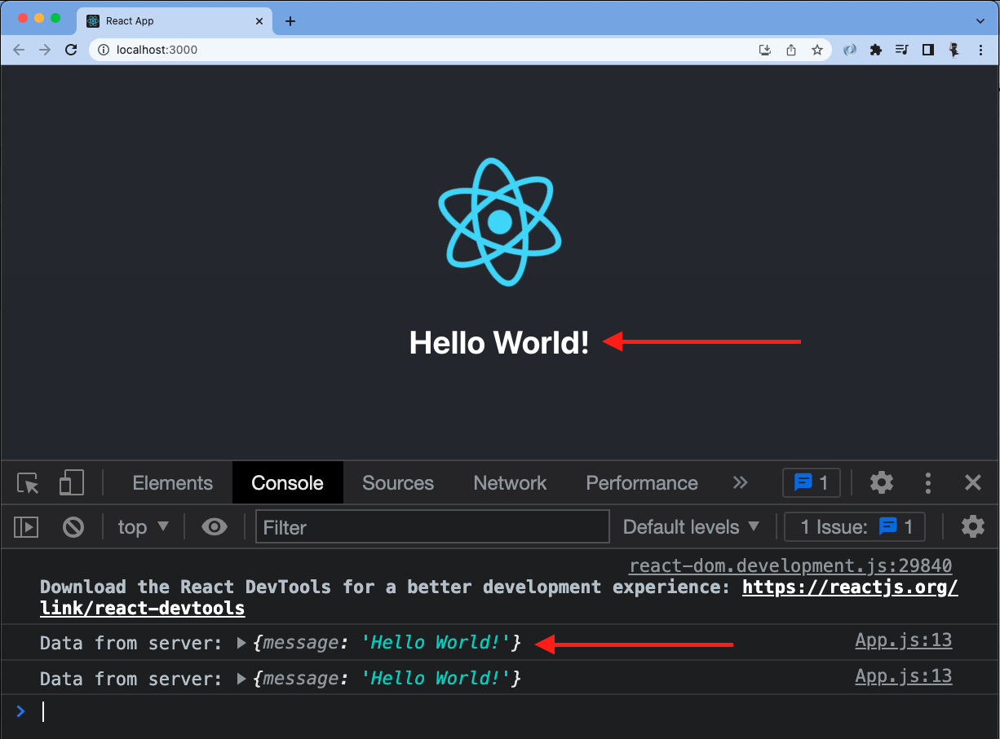
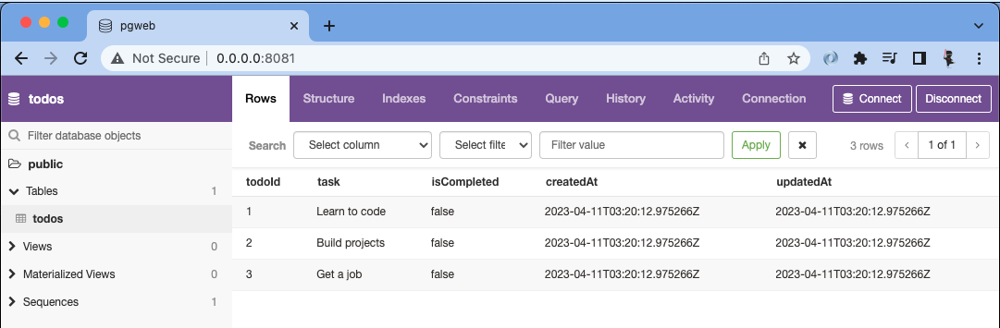

# final-project

A full stack JavaScript solo project.

## Getting Started

---

### Use this template to create a new repo on your GitHub account

1. Click the green `Use this template` button, select `Create a new repository`
   1. Under `Owner` select your username
   1. Give your repository a name
   1. (Optional) Add a description
   1. Leave repository as `Public`
   1. **DO NOT** Include all branches
   1. Click the green `Create repository from template` button

---

### Clone Newly created repo into `lfz-code`

1. From your newly created repo on GitHub, click the green `<> Code` button, then copy **SSH** URL
1. Open `lfz-code`, click on blue `><` button in bottom left of `lfz-code`
   1. Select `Clone Repository in Container Volume...`
   1. Paste **SSH** URL for your repo, click `Clone git repository from URL`

---

### Run and test full-stack project setup

#### Getting Started

1. Install all dependencies with `npm install`.

#### Create the database

If your final project will be using a database, create it now.

1. Start PostgreSQL
   ```sh
   sudo service postgresql start
   ```
1. Create database (replace `name-of-database` with a name of your choosing)
   ```sh
   createdb name-of-database
   ```
1. In the `server/.env` file, in the `DATABASE_URL` value, replace `changeMe` with the name of your database, from the last step
1. While you are editing `server/.env`, also change the value of `TOKEN_SECRET` to a custom value, without spaces.

If your final project will _not_ be using a database, edit `package.json` to remove the `dev:db` script.

#### Start the development servers

1. Start all the development servers with the `"dev"` script:
   ```sh
   npm run dev
   ```
1. Later, when you wish to stop the development servers, type `Ctrl-C` in the terminal where the servers are running.

#### Verify the client

1. A React app has already been created for you.
1. Take a minute to look over the code in `client/src/App.js` to get an idea of what it is doing.
1. Go to [http://localhost:3000](http://localhost:3000) in your browser. You should see the message from the server below the React logo, and in the browser console.
   
1. If you see the message from the server in your browser you are good to go, your client and server are communicating.

#### Set up the database

1. In your browser navigate to the site you used for your database design.
1. Export your database as PostgreSQL, this should generate the SQL code for creating your database tables.
   - Reach out to an instructor if you have any issues with this step
1. Copy the generated SQL code and paste it into `database/schema.sql` below the preexisting sql code in the file. The end result should look something like: _(You will likely have more tables)_

   ```SQL
   set client_min_messages to warning;

   -- DANGER: this is NOT how to do it in the real world.
   -- `drop schema` INSTANTLY ERASES EVERYTHING.
   drop schema "public" cascade;

   create schema "public";

   create table "public"."todos" (
       "todoId"      serial,
       "task"        text           not null,
       "isCompleted" boolean        not null,
       "createdAt"   timestamptz(6) not null default now(),
       "updatedAt"   timestamptz(6) not null default now(),
       primary key ("todoId")
   );
   ```

   - **NOTE:** Database design websites do not do a perfect job of generating SQL, so you may need to make some adjustments to your SQL for it to work correctly. Reach out to your instructor if you need assistance.

1. In a separate terminal, run `npm run db:import` to create your tables
1. Use `pgweb` (at `localhost:8081`) to verify your tables were created successfully
1. In `pgweb` you should see your database and tables; if you do not, stop here and reach out to an instructor for help
1. At this point your database is setup and you are good to start using it. However there is no data in your database, which isn't necessarily a bad thing, but if you want some starting data in your database you need to add insert statements into the `database/data.sql` file. You can add whatever starting data you need/want. Here is an example:
   ```SQL
   insert into "todos" ("task", "isCompleted")
   values
       ('Learn to code', false),
       ('Build projects', false),
       ('Get a job', false);
   ```
1. After any changes to `database/schema.sql` or `database/data.sql` re-run the `npm run db:import` command to update your database. Use `pgweb` to verify your changes were successfully applied
   

**Happy coding!!!!**

---

### Available `npm` commands explained

Below is an explanation of all included `npm` commands in the root `package.json`. These are primarily used for deployment purposes and should not be necessary for development.

1. `start`
   - The `start` script starts the Node server in `production` mode, without any file watchers.
1. `build`
   - The `build` script executes `npm run build` in the context of the `client` folder. This builds your React app for production. This is used during deployment, and not commonly needed during development.
1. `db:import`
   - The `db:import` script executes `database/import.sh`, which executes the `database/schema.sql` and `database/data.sql` files to build and populate your database.
1. `dev`
   - Starts all the development servers.
1. Not directly used by developer
   1. `install:*`
   - These scripts install dependencies in the `client` and `server` folders, and copy `.env.example` to `.env` if it doesn't already exist.
   1. `dev:*`
   - These scripts start the individual development servers.
   1. `postinstall`
      - The `postinstall` script is automatically run when you run `npm install`. It is executed after the dependencies are installed. Specifically for this project the `postinstall` script is used to install the `client` and `server` dependencies.
   1. `prepare`
      - The `prepare` script is similar to `postinstall` — it is executed before `install`. Specifically for this project it is used to install `husky`.

---

## Deployment

Once you are ready, deployment instructions can be found [HERE](https://lms.learningfuze.com/code-guides/Learning-Fuze/curriculum/heroku-deployment)
